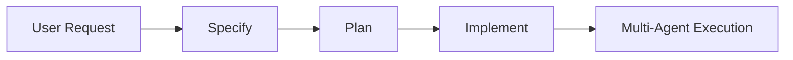

# CodeTeam AI Ultra - Multi-Agent Coder System

## 🚀 Was ist neu?

Das System wurde zu einem **echten Multi-Agent-Coder-System** umgebaut, bei dem mehrere KI-Agenten parallel und koordiniert zusammenarbeiten, um komplexe Programmieraufgaben zu lösen.

## 🎯 Architektur

### Supervisor Agent (Orchestrator)
Der **Supervisor** ist der Master-Koordinator, der:
- Komplexe Aufgaben analysiert
- Ausführungspläne mit mehreren Agenten erstellt
- Tasks auf spezialisierte Agenten verteilt
- Parallele Ausführung koordiniert
- Abhängigkeiten zwischen Tasks verwaltet

### Multi-Agent Executor
Der **Executor** führt die Pläne aus:
- Führt mehrere Agenten **parallel** aus (z.B. Tester + Reviewer gleichzeitig)
- Verwaltet Abhängigkeiten zwischen Tasks
- Gibt Live-Progress-Updates
- Sammelt und aggregiert alle Ergebnisse

### Spezialisierte Agenten

| Agent | Rolle | Spezialgebiet |
|-------|-------|---------------|
| 👔 **Product Manager** | Requirements | User Stories, PRDs, Requirements Analysis |
| 🏗️ **Architect** | System Design | Architektur, Design Patterns, Tech Stack |
| 👨‍💻 **Developer/Coder** | Implementation | Code-Generierung, Refactoring, Bugfixes |
| 🔍 **Reviewer** | Quality Assurance | Code Review, Best Practices |
| 🧪 **Tester** | Testing | Unit Tests, Integration Tests, Edge Cases |
| 📝 **Docs Writer** | Documentation | JSDoc, README, API Docs |
| 🎨 **UX Designer** | UI/UX | Component Design, Accessibility |
| 🔒 **Security** | Security | Security Audits, Vulnerability Analysis |
| ⚙️ **DevOps** | Operations | CI/CD, Docker, Deployment |

## 💡 Workflows

### 1. Specify → Plan → Implement (Empfohlen)



#### **Schritt 1: Specify** (`Cmd+Shift+P` → "CodeTeam AI: Specify Feature")
- Product Manager erstellt detaillierte Spezifikationen
- Ausgabe: User Stories, Requirements, Acceptance Criteria

#### **Schritt 2: Plan** (`Cmd+Shift+P` → "CodeTeam AI: Create Plan")
- Supervisor analysiert die Aufgabe
- Erstellt Ausführungsplan mit Tasks und Phasen
- Zeigt: Welche Agenten, in welcher Reihenfolge, was parallel läuft

#### **Schritt 3: Implement** (`Cmd+Shift+P` → "CodeTeam AI: Implement Plan")
- Multi-Agent Executor führt den Plan aus
- **Mehrere Agenten arbeiten parallel**
- Live-Progress in Output Channel
- Finale Zusammenfassung aller Ergebnisse

### 2. Direct Implement (Schnell)

```bash
Cmd+Shift+P → "CodeTeam AI: Implement Plan"
# Eingabe: "User authentication with JWT"
```

Supervisor erstellt automatisch den optimalen Workflow und führt ihn sofort aus.

## 🔥 Beispiel-Workflows

### Feature Implementation

**User Input:** "Implement user authentication with JWT"

**Supervisor Plan:**
```
Phase 1: [Product Manager] Analyze requirements ⏱️ 30s
Phase 2: [Architect] Design auth system ⏱️ 45s
Phase 3: [Security] Review security design ⏱️ 30s
Phase 4 (parallel):
  - [Developer] Implement backend ⏱️ 60s
  - [Developer] Implement frontend ⏱️ 60s
Phase 5 (parallel):
  - [Tester] Generate unit tests ⏱️ 40s
  - [Reviewer] Code review ⏱️ 30s
Phase 6: [Docs] Create documentation ⏱️ 20s
```

**Total:** ~3.5 Minuten, Agenten arbeiten parallel!

### Bug Fix

**User Input:** "Fix payment processing bug"

**Supervisor Plan:**
```
Phase 1: [Developer] Analyze and fix bug ⏱️ 30s
Phase 2 (parallel):
  - [Tester] Create regression test ⏱️ 20s
  - [Reviewer] Review fix ⏱️ 15s
```

**Total:** ~45 Sekunden

### Code Review

**User Input:** "Review this code" (mit selektiertem Code)

**Supervisor Plan:**
```
Phase 1 (parallel):
  - [Reviewer] Code quality review ⏱️ 20s
  - [Security] Security audit ⏱️ 20s
```

**Total:** ~20 Sekunden (beide parallel!)

## 🎮 Neue Commands

### 1. **Specify Feature**
```
Command: codeteam.specify
Keybinding: -
Workflow: Product Manager → erstellt Specs
```

Beispiel:
```
Input: "Social media sharing functionality"
Output: Detailed requirements, user stories, acceptance criteria
```

### 2. **Create Plan**
```
Command: codeteam.plan
Keybinding: -
Workflow: Supervisor → erstellt Ausführungsplan
```

Beispiel:
```
Input: "REST API for blog posts"
Output: 8-Task Plan mit Phasen und Zeiten
```

### 3. **Implement Plan**
```
Command: codeteam.implement
Keybinding: -
Workflow: Multi-Agent Execution
```

Beispiel:
```
Input: "Shopping cart with checkout"
Output: Vollständige Implementation durch Team
```

## 📊 Live Progress Tracking

Während der Multi-Agent-Ausführung siehst du:

1. **VS Code Notification**
   - Aktuelle Phase: "Phase 2/5"
   - Aktive Agenten: "3 agent(s) working"
   - Progress Bar

2. **Output Channel** (`View` → `Output` → "CodeTeam AI - Multi-Agent")
   ```
   ℹ️ Starting multi-agent execution for: User authentication
   ✅ Supervisor created plan: 7 tasks in 4 phases

   ━━━ Phase 1/4 ━━━
   ℹ️ [productManager] Starting: Create requirements...
   ✅ [productManager] ✓ Task completed

   ━━━ Phase 2/4 ━━━
   ℹ️ Executing 2 task(s) in parallel
   ℹ️ [developer] Starting: Implement backend...
   ℹ️ [developer] Starting: Implement frontend...
   ✅ [developer] ✓ Task completed
   ✅ [developer] ✓ Task completed
   ```

3. **Sidebar Panel**
   - Chat-basierte Updates
   - Ergebnisse von jedem Agent
   - Code-Blöcke zum Einfügen

## ⚙️ Konfiguration

### API Keys einrichten

1. Öffne Settings (`Cmd+,`)
2. Suche "codeteam"
3. Wähle deinen Provider:
   - **OpenAI**: GPT-4o (teuer, sehr gut)
   - **Anthropic**: Claude 3.5 Sonnet (beste Code-Qualität)
   - **Groq**: LLaMA 3.1 70B (**KOSTENLOS**, sehr schnell!)
   - **DeepSeek**: DeepSeek Coder (günstig, Code-spezialisiert)
   - **Ollama**: Local Models (offline, privat)

### Empfehlung für Start

**Groq** (kostenlos + schnell):
1. Gehe zu [console.groq.com](https://console.groq.com)
2. Registriere dich kostenlos
3. Erstelle API Key
4. Settings → `codeteam.groqApiKey` eintragen
5. Model: `llama-3.1-70b-versatile`

## 🧪 Testen

### Einfacher Test
```
1. Cmd+Shift+P → "CodeTeam AI: Implement Plan"
2. Input: "Create a hello world function"
3. Beobachte: Supervisor erstellt Plan → Developer implementiert → Tester testet
```

### Komplexer Test
```
1. Cmd+Shift+P → "CodeTeam AI: Specify Feature"
2. Input: "User profile page with avatar upload"
3. Wenn fertig: "Create Plan"
4. Wenn Plan OK: "Implement Now"
5. Beobachte: 6-8 Agenten arbeiten parallel durch die Phasen
```

## 🔄 Wie es vorher war vs. jetzt

### ❌ Vorher (Single-Agent)
```
User → Developer Agent → wartet... → Done
⏱️ 60 Sekunden
```

### ✅ Jetzt (Multi-Agent)
```
User → Supervisor → Plan erstellen
  ↓
Phase 1: PM → Specs
  ↓
Phase 2: Architect → Design
  ↓
Phase 3: [Developer 1 + Developer 2] parallel
  ↓
Phase 4: [Tester + Reviewer + Security] parallel
  ↓
Phase 5: Docs
  ↓
Done (mit Code, Tests, Docs, Review)
⏱️ 90 Sekunden (aber komplettes Feature!)
```

## 🎯 Best Practices

### 1. Beschreibungen klar formulieren
```
❌ "Make auth"
✅ "Implement JWT-based authentication with refresh tokens for REST API"
```

### 2. Workflow-Stufen nutzen
```
Specify → Plan → Review Plan → Implement
```
So siehst du den Plan vor der Ausführung.

### 3. Output Channel beobachten
```
View → Output → "CodeTeam AI - Multi-Agent"
```
Hier siehst du genau was jeder Agent macht.

### 4. Klein anfangen
```
Start: "Fix this typo"
Dann: "Add error handling"
Dann: "Implement user registration"
```

## 🐛 Troubleshooting

### "No API Key configured"
→ Settings → `codeteam.groqApiKey` (oder anderen Provider) eintragen

### "Plan creation failed"
→ LLM hatte Problem JSON zu generieren → Fallback Plan wird verwendet

### Agents arbeiten nicht parallel
→ Das ist OK! Manche Tasks haben Abhängigkeiten und MÜSSEN sequentiell sein

### Zu langsam
→ Wechsle zu Groq (ultra-schnell) oder lokales Ollama

## 📈 Performance

### Parallelisierung
- **Ohne Abhängigkeiten:** 2-4 Agenten parallel
- **Mit Abhängigkeiten:** Automatisch sequentiell
- **Speedup:** Bis zu 3x schneller als sequentiell

### Token Usage
- Supervisor: ~1000-2000 tokens
- Pro Agent: ~500-4000 tokens
- Feature-Implementation: ~10k-30k tokens total

## 🚀 Nächste Schritte

1. **Drücke `F5`** in VS Code um Extension zu starten
2. **Konfiguriere API Key** (Groq empfohlen)
3. **Teste:** `Cmd+Shift+P` → "CodeTeam AI: Implement Plan"
4. **Eingabe:** "Create a todo list component"
5. **Beobachte:** Multi-Agent Team bei der Arbeit!

## 📝 Weitere Features

- ✅ 8 Provider Support
- ✅ Parallele Agent-Ausführung
- ✅ Live Progress Tracking
- ✅ Smart Task-Zerlegung
- ✅ Dependency Management
- ✅ Code-Block Extraktion
- ✅ Build & Test Integration
- ✅ Memory & Context Sharing
- ✅ Fallback wenn LLM versagt

Viel Erfolg mit deinem Multi-Agent Coder Team! 🎉
